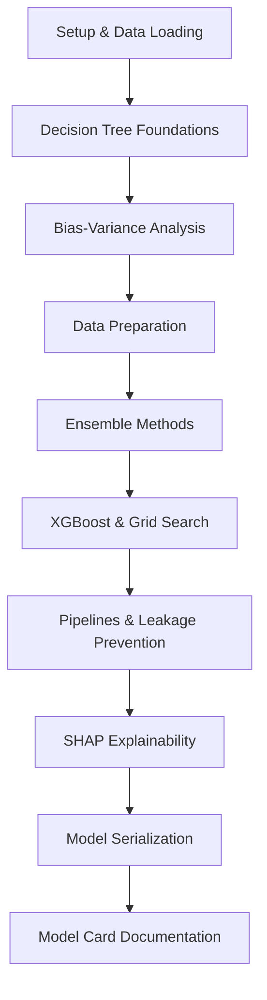

# 🌳 Tree-Based Models & Ensembles: Telco Churn Project


> Week 5 Assignment for the AI Fellowship Program focused on Decision Trees, Random Forests, Ensemble Learning, XGBoost, Explainable AI, and Production-Ready Machine Learning Pipelines.

---

## 📖 Overview

This project explores the complete lifecycle of building, evaluating, interpreting, and deploying tree-based machine learning models using the **Telco Customer Churn Dataset**.

The assignment emphasizes:

- Understanding Decision Trees from first principles
- Exploring bias-variance tradeoffs
- Preventing data leakage
- Comparing Bagging, Random Forests, and Boosting
- Building production-grade ML pipelines
- Interpreting model decisions using SHAP
- Exporting and deploying trained models

Instead of treating machine learning as a black box, this project focuses on understanding the mathematical and engineering foundations behind modern ensemble models.

---

## 🎯 Learning Objectives

By completing this project, you will learn how to:

✅ Implement Decision Tree metrics from scratch

✅ Understand Gini Impurity, Entropy, and Information Gain

✅ Visualize underfitting and overfitting behavior

✅ Clean and preprocess real-world datasets

✅ Build Random Forest and XGBoost models

✅ Prevent data leakage using pipelines

✅ Apply SMOTE correctly in cross-validation

✅ Interpret predictions using SHAP values

✅ Deploy models through serialization

---

## 📂 Repository Structure

```text
├── W5_Tree-Based Models & Ensembles_Assignment.ipynb
├── Telco-Customer-Churn.csv
├── telco_churn_v1.joblib
├── README.md
```

### Files

| File | Description |
|--------|-------------|
| `W5_Tree-Based Models & Ensembles_Assignment.ipynb` | Main notebook containing all exercises and implementations |
| `Telco-Customer-Churn.csv` | Dataset containing customer churn information |
| `telco_churn_v1.joblib` | Serialized production-ready pipeline |
| `README.md` | Project documentation |

---

## 🏗️ Project Workflow



---

# 📚 Project Stages

## 1️⃣ Setup & Data Loading

### Tasks

- Import required libraries
- Load dataset
- Explore dataset structure
- Check missing values
- Inspect data types

### Libraries

```python
import pandas as pd
import numpy as np
import matplotlib.pyplot as plt

from sklearn.tree import DecisionTreeClassifier
from sklearn.ensemble import RandomForestClassifier
from sklearn.model_selection import train_test_split
```

---

## 2️⃣ Decision Tree Foundations

Implement key decision tree concepts manually:

### Gini Impurity

```text
Gini = 1 − Σ(p²)
```

### Entropy

```text
Entropy = −Σ(p log₂ p)
```

### Information Gain

```text
IG = Parent Entropy − Weighted Child Entropy
```

### Goals

- Understand node purity
- Calculate optimal splits
- Learn how trees make decisions

---

## 3️⃣ Bias vs Variance Analysis

Using synthetic datasets:

```python
from sklearn.datasets import make_moons
```

Study:

- Underfitting
- Good fit
- Overfitting

Visualize how model performance changes as tree depth increases.

### Concepts

| Low Depth | High Depth |
|------------|------------|
| High Bias | High Variance |
| Underfit | Overfit |
| Poor Training Accuracy | Poor Generalization |

---

## 4️⃣ Data Preparation & Accuracy Trap

### Dataset Challenges

The Telco dataset contains malformed numeric values.

Example:

```text
" "
```

inside the `TotalCharges` column.

### Tasks

- Replace whitespace values
- Convert to float
- Handle missing values
- Encode categorical variables

### Business Perspective

Accuracy alone can be misleading.

Use:

- Confusion Matrix
- Precision
- Recall
- F1 Score

to evaluate churn prediction performance.

---

## 5️⃣ Ensemble Learning

### Bagging

Build intuition behind:

```python
BaggingClassifier
```

Learn:

- Bootstrap sampling
- Variance reduction
- Model averaging

---

### Random Forest

Study:

```python
RandomForestClassifier
```

Key idea:

```text
Random Rows + Random Features
```

Benefits:

- Better generalization
- Lower variance
- Reduced overfitting

---

## 6️⃣ Boosting & Hyperparameter Tuning

Train an optimized:

```python
XGBClassifier
```

### Hyperparameters

- max_depth
- learning_rate
- n_estimators
- subsample
- colsample_bytree

### Optimization

Use:

```python
GridSearchCV
```

to discover the best model configuration.

---

## 7️⃣ Pipelines & Data Leakage Prevention

Build a complete machine learning pipeline.

### Components

```text
Raw Data
    ↓
Preprocessing
    ↓
SMOTE
    ↓
Model
```

### ColumnTransformer

Separate:

- Numerical Features
- Categorical Features

### Leakage Demonstration

Compare:

❌ Incorrect Workflow

```text
SMOTE → Train/Test Split
```

vs

✅ Correct Workflow

```text
Train/Test Split
       ↓
Pipeline
       ↓
SMOTE inside CV folds
```

---

## 8️⃣ Explainable AI with SHAP

Use:

```python
import shap
```

to understand model behavior.

### Analyses

#### Global Explanations

- Feature Importance
- Summary Plots

#### Local Explanations

- Waterfall Plots
- Individual Customer Predictions

Questions answered:

- Why did the model predict churn?
- Which features contributed most?

---

## 9️⃣ Deployment & Serialization

Save trained models using:

```python
import joblib
```

### Export

```python
joblib.dump(model, "telco_churn_v1.joblib")
```

### Reload

```python
model = joblib.load("telco_churn_v1.joblib")
```

Verify that predictions remain consistent after loading.

---

## 🔟 Model Card Documentation

Create a model card describing:

### Model Information

- Model Type
- Dataset
- Objective

### Performance

- Accuracy
- Precision
- Recall
- F1 Score

### Intended Use

- Customer retention
- Churn prediction

### Limitations

- Data drift
- Feature distribution changes
- Class imbalance

---

# 📊 Dataset Information

| Attribute | Value |
|------------|---------|
| Dataset | Telco Customer Churn |
| Records | 7,043 |
| Features | 21 |
| Target | Churn |
| Type | Binary Classification |
| Challenge | Class Imbalance |

### Target Classes

```text
Yes  → Customer Churned
No   → Customer Retained
```

---

## 🚀 Installation

### Clone Repository

```bash
git clone https://github.com/your-username/your-repository.git

cd your-repository
```

### Create Virtual Environment

```bash
python -m venv venv
```

### Activate Environment

Windows

```bash
venv\Scripts\activate
```

Linux / MacOS

```bash
source venv/bin/activate
```

### Install Dependencies

```bash
pip install pandas numpy matplotlib seaborn scikit-learn imbalanced-learn xgboost shap joblib notebook
```

---

## ▶️ Running the Project

Launch Jupyter Notebook:

```bash
jupyter notebook
```

Open:

```text
W5_Tree-Based Models & Ensembles_Assignment.ipynb
```

Run all cells sequentially.

---

## 🏆 Skills Gained

After completing this assignment, you will be able to:

- Design Decision Tree models from first principles
- Analyze bias and variance tradeoffs
- Build Random Forest ensembles
- Train gradient boosted trees with XGBoost
- Prevent data leakage in production pipelines
- Explain model decisions using SHAP
- Serialize and deploy machine learning pipelines
- Document ML systems using model cards

---

## 🔮 Future Improvements

Potential extensions:

- LightGBM implementation
- CatBoost implementation
- Feature selection experiments
- Model monitoring dashboard
- Drift detection pipeline
- FastAPI deployment service
- Docker containerization
- CI/CD integration

---

## 🎓 AI Fellowship Program

This repository is part of the AI Fellowship Program's Week 5 curriculum on:

**Tree-Based Models, Ensemble Learning, Explainable AI, and Production Machine Learning Engineering.**

---

## 📜 License

This project is intended for educational and learning purposes.

Feel free to fork, experiment, and extend the implementation.

---

### 💡 Fellowship Reminder

> Automated tests validate your implementation, but the quality of your written explanations, analytical reasoning, and interpretation of results are equally important. Focus on understanding *why* a model behaves a certain way, not just achieving a high score.
